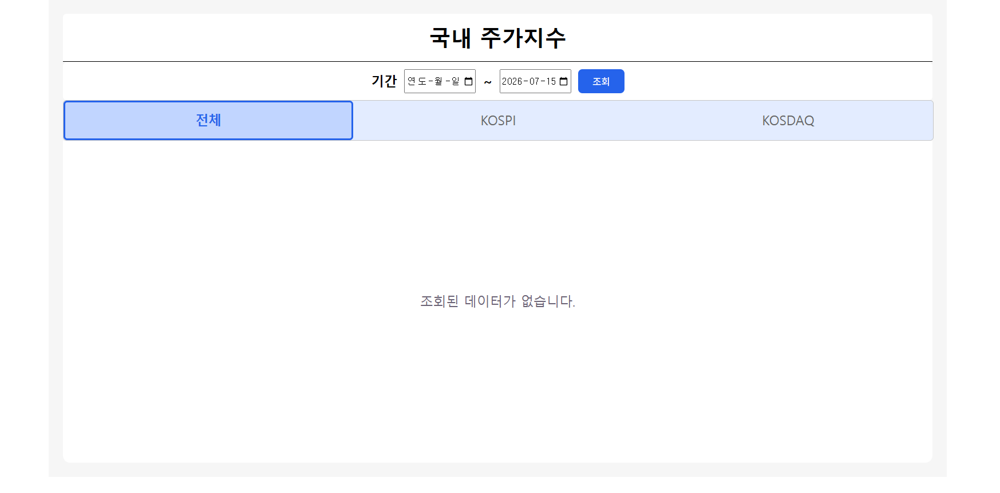
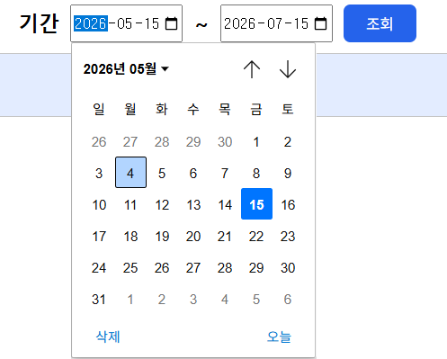
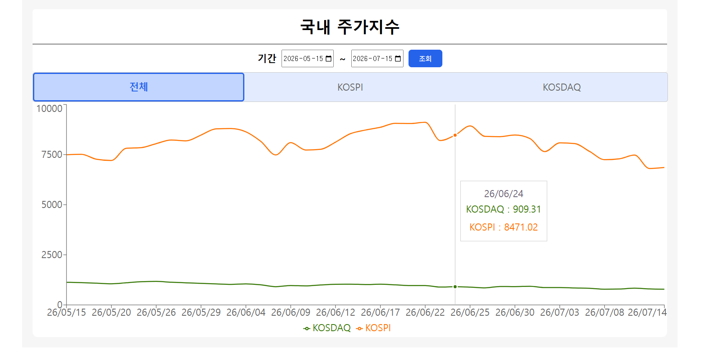
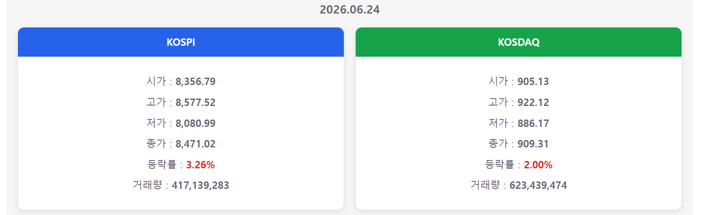

# Stock Project

KRX(한국거래소)의 KOSPI · KOSDAQ 일별 지수 데이터를 자동으로 수집·저장하고, 기간별 추이를 웹 차트로 시각화하는 풀스택 프로젝트입니다.

프로젝트는 React 기반 프론트엔드와 Spring Boot 기반 REST API로 구성되어 있으며, 백엔드는 KRX API와 동기화한 데이터를 데이터베이스에 저장하고 프론트엔드에 제공합니다.

> 이 문서는 프로젝트의 전체 구조를 설명합니다.  
> 각 애플리케이션의 실행 방법, API 명세, 환경 변수 등은 하위 README를 참고하세요.

## Demo

- **Frontend**  
  https://stock-project-kappa.vercel.app/

---

# Screenshots

## 메인 화면



---

## 날짜 선택



---

## 차트 조회



---

## 상세 정보



---

## 상세 문서

- [Frontend README](https://github.com/bys96/stock-project/blob/main/stock-frontend/README.md)
- [Backend README](https://github.com/bys96/stock-project/blob/main/stock-api/README.md)

---

# Tech Stack

| 분야     | 기술                                                             |
| -------- | ---------------------------------------------------------------- |
| Frontend | React 19, Vite, Axios, Recharts                                  |
| Backend  | Java 17, Spring Boot, Spring Data JPA, Spring WebFlux(WebClient) |
| Database | MySQL (Local), PostgreSQL (Production)                           |
| Deploy   | Vercel, Render, Neon PostgreSQL                                  |

---

## 프로젝트 특징

- KRX API 데이터를 자동으로 동기화하여 데이터베이스에 저장
- 마지막 저장일 이후 데이터만 조회하여 중복 요청 최소화
- 서버 시작 시 초기 데이터 자동 동기화
- 매일 18:00 자동 동기화 스케줄링
- React와 Spring Boot를 분리하여 독립 배포
- Local(MySQL)과 Production(PostgreSQL) 환경 분리

---

# 프로젝트 구성

```text
stock-project/
├── stock-frontend/      # React/Vite 웹 애플리케이션
├── stock-api/           # Spring Boot REST API
└── README.md
```

---

# 시스템 구성

| 영역           | 역할                                |
| -------------- | ----------------------------------- |
| stock-frontend | 사용자 입력, 차트 및 상세 정보 표시 |
| stock-api      | KRX 데이터 수집 및 REST API 제공    |
| Database       | 지수 데이터 저장                    |
| KRX Data API   | 원천 지수 데이터 제공               |

---

# 전체 흐름

```text
                 KRX Data API
                       │
             시작 시 · 매일 18:00 동기화
                       ▼
          MySQL / PostgreSQL
                       ▲
                  데이터 조회
                       │
              Spring Boot API
                       ▲
                 REST API 응답
                       │
               React Frontend
                       ▲
                  사용자 요청
```

### 데이터 처리 과정

1. 서버가 시작되면 비동기로 KRX 데이터를 동기화합니다.
2. DB가 비어 있으면 최근 1년 데이터를 저장합니다.
3. 이후에는 마지막 저장일 다음 거래일부터 오늘까지의 데이터만 추가 저장합니다.
4. 동일한 작업이 매일 18:00 자동 실행됩니다.
5. `(market, trade_date)`를 기준으로 중복 저장을 방지합니다.
6. 프론트엔드는 KOSPI와 KOSDAQ 데이터를 병렬 요청하여 차트를 표시합니다.
7. 차트의 특정 날짜를 선택하면 해당 일자의 상세 정보를 조회합니다.

---

# 주요 기능

- KOSPI / KOSDAQ 지수 자동 동기화
- 기간별 지수 조회
- KOSPI · KOSDAQ 병렬 조회
- 선 그래프 기반 데이터 시각화
- 선택한 날짜의 상세 지수 정보 제공
- CORS 허용 도메인 관리
- 개발(Local) / 운영(Production) 환경 분리

---

# 기술 선택 이유

| 기술               | 선택 이유                                                                                        |
| ------------------ | ------------------------------------------------------------------------------------------------ |
| React              | 컴포넌트 기반으로 UI를 구성하고 상태에 따라 화면을 효율적으로 갱신하기 위해 선택했습니다.        |
| Spring Boot        | REST API 개발과 데이터 처리 로직을 안정적으로 구현하기 위해 사용했습니다.                        |
| Spring Data JPA    | 반복적인 SQL 작성 없이 데이터베이스를 효율적으로 관리하기 위해 사용했습니다.                     |
| Spring WebClient   | KRX API와 비동기 통신을 수행하기 위해 사용했습니다.                                              |
| Recharts           | React와 쉽게 연동되며 기간별 지수 데이터를 직관적으로 시각화할 수 있어 선택했습니다.             |
| MySQL / PostgreSQL | 개발 환경은 MySQL, 운영 환경은 Render 무료 환경과 연동하기 위해 PostgreSQL(Neon)을 사용했습니다. |
| Vercel / Render    | Frontend와 Backend를 각각 독립적으로 배포하고 운영하기 위해 사용했습니다.                        |

# 빠른 시작

## 1. 요구 사항

- Java 17
- Node.js
- npm
- MySQL 또는 PostgreSQL
- KRX API Key

---

## 2. Backend 실행

```powershell
cd stock-api
Copy-Item src/main/resources/application-local.properties.sample src/main/resources/application-local.properties
```

### 개발(Local)

`application-local.properties`

- MySQL 또는 PostgreSQL
- KRX API Key
- Frontend 주소

설정 후 실행

```powershell
$env:SPRING_PROFILES_ACTIVE="local"
.\gradlew.bat bootRun
```

---

### 운영(Production)

운영 환경에서는 `application-prod.properties` 또는 환경 변수를 사용합니다.

예시

- PostgreSQL
- KRX API Key
- 운영 Frontend 주소(CORS)
- 기타 운영 설정

```powershell
$env:SPRING_PROFILES_ACTIVE="prod"
java -jar stock-api.jar
```

기본 API 주소

```
http://localhost:8080
```

첫 실행 시 데이터 동기화가 진행되므로 초기 실행에 시간이 소요될 수 있습니다.

---

## 3. Frontend 실행

```powershell
cd stock-frontend

Copy-Item .env.sample .env

npm install

npm run dev
```

`.env`

```dotenv
VITE_API_URL=http://localhost:8080/api
```

개발 서버

```
http://localhost:5173
```

---

# 환경 변수

| 위치                         | 용도               |
| ---------------------------- | ------------------ |
| stock-frontend/.env          | Frontend 개발 환경 |
| application-local.properties | Backend 개발 환경  |
| application-prod.properties  | Backend 운영 환경  |

관리 항목

- DB 접속 정보
- KRX API Key
- Frontend URL(CORS)
- 기타 운영 설정

> 실제 설정 파일은 Git에 포함하지 않습니다.

> `VITE_`로 시작하는 값은 브라우저에 노출되므로 민감한 정보를 저장하면 안 됩니다.

---

# 배포

현재 배포 구성

| 서비스   | 플랫폼          |
| -------- | --------------- |
| Frontend | Vercel          |
| Backend  | Render          |
| Database | Neon PostgreSQL |

배포 순서

1. PostgreSQL 준비
2. Backend 환경 변수 설정
3. Backend(Render) 배포
4. Frontend(Vercel) 배포
5. `frontend.urls`에 실제 도메인 등록

---

# Trouble Shooting

## 운영 데이터베이스 변경

### 문제

Render 무료 환경에서는 MySQL을 제공하지 않아 운영 환경에서 사용할 데이터베이스 구성이 필요했습니다.

### 해결

개발 환경은 MySQL을 유지하고, 운영 환경은 Neon PostgreSQL을 사용하도록 프로필을 분리하여 환경별 데이터베이스를 구성했습니다.

---

## 중복 데이터 저장 방지

### 문제

동기화 작업이 반복 실행될 경우 동일한 날짜의 데이터가 중복 저장될 수 있었습니다.

### 해결

`(market, trade_date)`를 기준으로 기존 데이터를 확인한 후 저장하도록 구현하여 중복 데이터를 방지했습니다.

---

## 불필요한 데이터 재수집 개선

### 문제

매번 전체 데이터를 다시 조회하면 API 호출량과 처리 시간이 증가했습니다.

### 해결

DB의 마지막 저장일을 기준으로 이후 거래일 데이터만 조회하도록 구현하여 불필요한 API 호출을 줄였습니다.

# Developer

**변윤석**
